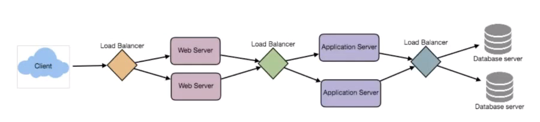

# Consistent Hashing

## The problem of naive hashing function

A naive hashing function is `key % n` where `n` is the number of servers.

It has two major drawbacks:

1. NOT horizontally scalable, or in other words, NOT partition tolerant. When you add new servers, all existing mapping are broken. It could introduce painful maintenance work and downtime to the system.
2. May NOT be load balanced. If the data is not uniformly distributed, this might cause some servers to be hot and saturated while others idle and almost empty.

Problem 2 can be resolved by hashing the key first, `hash(key) % n`, so that the hashed keys will be likely to be distributed more evenly. But this can't solve the problem 1. We need to find a solution that can distribute the keys and is not dependent on `n`.

## Consistent Hashing

Consistent Hashing allows distributing data in such a way that minimize reorganization when nodes are added or removed, hence making the system easier to scale up or down.

The key idea is that it's a distribution scheme that DOES NOT depend directly on the number of servers.

In Consistent Hashing, when the hash table is resized, in general only `k / n` keys need to be remapped, where `k` is the total number of keys and `n` is the total number of servers.

* When a new node is added, it takes shares from a few hosts without touching other's shares
* When a node is removed, its shares are shared by other hosts.

## How it works?

### Basic Setup

Suppose our hash function output range is `[0, INT_MAX]`. We regard the range as a "ring" -- the "Hash Ring".

As shown below, the hashes of the keys scatter on the Hash Ring.

And we also hash our servers onto the ring. Suppose we have three servers, A, B and C.

For each key, we find its correponding server by looking closewise. So "Alice" and "Bob" are mapped to server B, and "Casey" is mapped to server A. Server C is idle.

If we add a new server D, some of the keys that used to map to other servers will map to server D.

If we remove server B, the keys used to map to server B will map to another server.

### Virtual Nodes

One problem of the basic setup above is that the loads of the servers are not evenly distributed.

To overcome this issue, we hash each server using multiple hash functions to get multiple placements on the ring.

For example, if we use 3 hash functions, server A will be mapped to `A0`, `A1` and `A2`.

Now "Alice" is mapped to server A via `A1`, "Bod" to server B via `B0`, "Casey" to server C via `C1`.

Those different hashes of the same server are called "Virtual Nodes". `A0`, `A1` and `A2` are virtual nodes of server A.

With these virtual nodes, the keys will be distributed more evenly on different servers.

Now if we add another server D, only a small portion of the keys will be remapped from other servers to server D. For example, "George" is remapped from server A to server D.

If we remove server C, the keys used to map to server C will be remapped to other servers. For example, "Eric" and "David" are remapped to server A, while "Casey" is remapped to server B.

### Weight

The number of virtual nodes of a specific node is call "Weight". In the above example all the servers are using the same weight.

But in cases where some of the servers are more powerful than others, then these powerful servers can get higher weight, hence have more virtual nodes, so keys are more likely to be distributed to these servers.

## Reference

1. [https://www.toptal.com/big-data/consistent-hashing](https://www.toptal.com/big-data/consistent-hashing)

